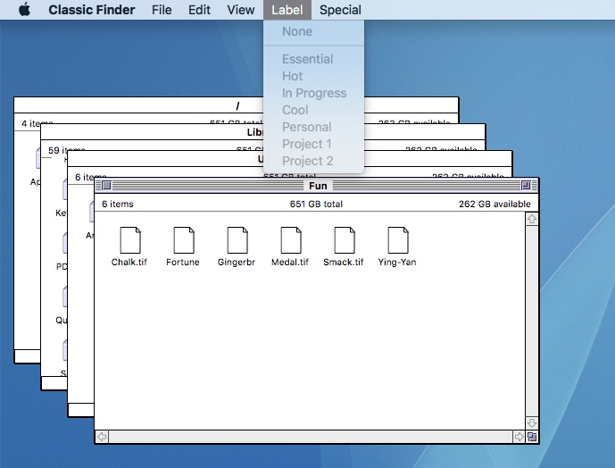

# Classic Mac Finder
> Everything you loved about navigating files on your Macintosh Performa, Quadra, LC or Power Macintosh.

This project aims to be a functional re-creation of the classic Mac OS Finder. 
Now you can experience a pixel-for-pixel clone of the original Macintosh Finder 
on your modern Mac. This application is written in Objective-C and Cocoa.

## Installation

This application is distributed as an unsigned .app binary. All releases can be found
under the Downloads tab to the left. A download of the most recent version is linked
on [https://classicmacfinder.com](https://classicmacfinder.com).

Install as you would any other cocoa app.

### System Requirements

* macOS 10.11+
* ~250 kb of free disk space

## Release History

* 1.1.1
	* Added the 1px white spacer between the detail bar and the scroll view.
	* Now distributing both code-signed and unsigned binaries. 
	* Minimum system requirement is now macOS 10.11.
* 1.1
	* Spatial window behavior! Finder windows now remember where you last placed them! :)
	* Relicensed the entire project under Apache v2.
* 1.0.2
	* The icons of opened folders now render with the correct background texture.
	* If there are no open windows, clicking on the app icon in the Dock will open a new window at root.
	* Finder windows representing the root volume now show the volume name instead of "/".
* 1.0.1
	* Fix scrollbar up and left button positioning.
* 1.0.0
    * Initial Release

## Meta

Ben Szymanski - [@captainflotsam](https://twitter.com/captainfloatsam)

Distributed under the Apache v2 license. See ``LICENSE`` for more information.

[https://bitbucket.org/bszyman/](https://bitbucket.org/bszyman/)
